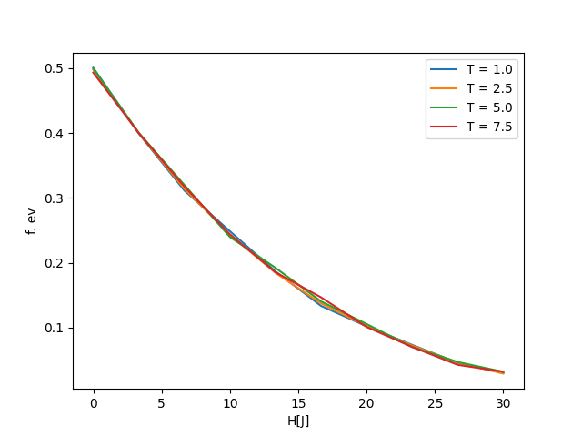

# Tax evasion study in a society realized as a diluted Ising model with competing interactions (article from J. Giraldo-Barreto et J. Restrepo)

## Summary

In this article, the authors look at the economic and social problem of tax evasion.
social problem of tax evasion, which consists of an agent reducing the amount of tax
tax by transferring assets to a country with a more favourable tax regime.
more advantageous tax regime.

In order to approach this phenomenon, in their research they use Ising's model, describing a company made up of $N$ agents (spins).
Ising's model, describing a society made up of $N$ agents (Ising spins) who choose whether or not to pay their taxes.
spins) who choose whether or not to pay their taxes (2 values of
spin: $\sigma = +1$ or $-1$) and between which information is exchanged.
information. These exchange interactions (paramagnetic bonds
ferromagnetic or dangling bonds) create a form of frustration similar to the magnetic frustration
to magnetic frustration for the agent who has to make a decision
while taking into account the contradictory information communicated by
closest neighbours. In addition, all individuals are subject to
policies (external magnetic field $H$) and can be audited with a certain
be audited with a certain probability $\alpha$.

Other exogenous parameters are also studied. The temperature $T$, for example
for example, is seen here as a global parameter representing the time
for a policy to be implemented. Tax evasion
becomes significant when this temperature exceeds the
transitional temperature $T_c$ (time allowed to pay a tax).

The authors also point out that certain psychological parameters
psychological parameters can influence the rate of tax evasion. They
show that the introduction of an audit system, even a weak one
and penalty periods can significantly reduce the rate of tax evasion.
percentage of tax evasion, some agents fear the penalty more than others.
than others. Furthermore, for an audit probability of
exchange interactions have no influence on the final tax evasion steady state.
of tax evasion. On the other hand, for a non-zero audit probability
zero audit probability, the information provided by exchange interactions
helps to keep agents undecided over a longer period of time
and leads to a change in the final stationary state of evasion.

In order to determine what measures should be put in place to reduce
reduce tax evasion, the researchers used this model to reproduce the results
the results obtained in the case of Colombia, where tax evasion and corruption
and corruption are particularly prevalent. The values of the magnetic field
and the audit probability were chosen on the basis of the tax policies
tax policies implemented in the country in recent years.
years. They conclude that the combination of a flexible government policy
policy and a non-zero audit probability is necessary to effectively
effectively reduce tax evasion.

---
## Modelisation

Figure 1 : *graphique représentant le taux d'évasion fiscale en fonction
de la politique*

We have modelled the Ising model of the article in the case where there is no
no tax audit, i.e. where $\alpha = 0$.
$$f.ev = \frac{1}{N}\sum_{\sigma_i = -1} |\sigma_i|$$

We have then plotted the rate of tax evasion (f.ev) as a function of the
as a function of the severity of the policy applied (H \[J\]).

We can see that the more stringent the policy, the rarer tax evasion
tax evasion, which is in line with reality.

Contrary to what is presented in the article, we have observed that
temperature does not have a major impact on the rate of tax evasion
in our model. There are several reasons for this:

1.  The article did not specify the constants used ($k_B$, $J$,
    \...), we may have mistakenly used non-adapted constants
    thus distorting the result.

2.  The initial experiment performs a lot of operations and takes a larger
    grid than ours. We chose to reduce these
    because the calculation time was becoming too long and it was
    impossible to make the notebook work properly. This freedom
    could have been a source of errors.

## Link with the course

In order to illustrate the phenomenon of tax evasion, the authors of this article
use a statistical physics model similar to the Random-Field Ising Model
Random-Field Ising Model (RFIM), originally introduced to explain the magnetic
magnetic properties of disordered systems with defects or impurities.
defects or impurities. In the social sciences, this model illustrates a
binary choice made by agents: buy or sell, wear the mask or not
mask or not, pay taxes or not...

The $N$ agents are modelled by particles that can only take on
only 2 spin values: those who pay their taxes take the value
those who pay their taxes take the value $\sigma_i = +1$, those who don't pay their taxes take the value
$\sigma_i = -1$. The agents interact with each other and are linked by 3
different types of bond (paramagnetic, ferromagnetic or dangling), describing the
the influence on a given agent of the choices made by its nearest neighbours.
by its nearest neighbours. In the Giraldo-Barreto model,
the Hamiltonian operator, analogous to the total energy of the alloy
making up the society of agents, is given by equation (1):
$$\mathcal{H} = -\sum_{<i,j>} J_{ij}\sigma_i \sigma_j - \sum_i\sigma_i H + \sum_{i \in A | \sigma_i=-1}\sigma_i g_i(t-h)$$.

The eigenvalues of this operator correspond to the energy
$E(\sigma_i)$ of each site i, which describes agent i's incentive to make the choice
make the choice $\sigma_i = 1$. Expression (1) is similar to that for
energy of a site obtained for the RFIM and seen in class (with the
difference is that the expression refers to the overall energy of the system,
and not that of a site). In both cases we find the effect of
social pressure or imitation, represented by the term including the
connectivity matrix $(J_{ij})$ : if $J_{ij} > 0$ (ferromagnetic bonds), the
links), agent i will tend to imitate agent j; if
$J_{ij} < 0$ (paramagnetic bonds), agent i will tend to make the choice
the opposite choice to that of agent j; and if $J_{ij} = 0$ (dangling links), agent i's
links), agent $j$'s decision will have no influence on agent i and vice versa.
agent i and vice versa. Unlike the model seen in class, where we
considered interactions between all the agents, the model studied here only considers
only considers interactions between first neighbours. In both
In both models, the agents are subjected to a uniform external magnetic field
modelling an exogenous factor. In the Giraldo-Barreto model, $H$
represents government policies imposed on agents. In the
model, this second term represents information that is public and accessible to all agents.
accessible by all agents. The RFIM model also includes a third term
term $f_i$ which refers to personal inclination (the agent's personal
experience or education). This term does not appear in (1)
but is replaced by a term which gives the interaction between the agents
who do not wish to pay their taxes and a local field $g_i$.
corresponding to an audit of agent $i$ by the State, characterised by a
probability $\alpha$ of intervention.

In addition, the agents considered wish to maximise their profit (rational choice
(rational choice theory), while taking into account exchange interactions
with their nearest neighbours and the audit risk incurred.
The probability of an agent i taking the value +1 or -1 is written as :

$$\pi(\sigma_i) = \frac{1}{1 + e^{-\frac{E(-\sigma_i)-E(\sigma_i)}{k_B T}}}$$

with $E(-\sigma_i) - E(\sigma_i)$ the energy associated with a change of
value of the spin at site i.

This decision rule, which has similarities with the
rule, therefore also takes into account the exchange interactions between the agents and the State.
agents and the State. In the RFIM, the inverse of the $\beta$ temperature which
appears in the logit rule, characterises the agent's level of rationality
the agent, whereas in the Giraldo-Barreto model, temperature is a global
a global parameter that is associated with the time required for a policy to be
policy is actually implemented.

Finally, there are other similarities between the models. For example
the global magnetisation defined by $m_k = \frac{1}{N}\sum_i \sigma_i$ is analogous to the mean opinion defined in the RFIM.
is similar to the mean opinion defined in the RFIM. On the
graphs obtained by the authors and on the one obtained from the
the expression of the magnetisation $m$ as a function of the field $h$ (Curie-Weiss equation), the
Curie-Weiss equation), we can discern a paramagnetic phase and a ferromagnetic phase.
ferromagnetic phase. In both cases, the paramagnetic phase is
characterised by a critical value (a transition temperature
$T_c$ or an average transition exchange interaction value
$J_c$).

##  Criticism of the model

In this article, Giraldo-Barreto and Restrepo seek to study the behaviour of tax
the behaviour of tax evaders in a society where the state can intervene
and where the different agents in that society can influence each other.
influence each other. A tax evader (or non
tax evader) is characterised by a spin of value -1 (respectively 1).
The authors have chosen to consider in their model that everything
that leads an individual to take one spin value or another is exogenous.
exogenous. In fact, this value changes over time as a result of
interactions with other individuals or with their environment. Nevertheless,
we can already see that an individual's decision to commit fraud,
in real life, is not only the result of external influences
but is also linked to their social class, financial situation, level of education
level of education or simply their character. The
model doesn't take these kinds of possibilities into account, because an individual of this type
of this type cannot be compared with an isolated individual: whatever
the information he receives from his neighbours or his relationships with his
with his environment, he is a fraudster by nature and his personal
personal characteristics. We could therefore imagine that
including a factor representing the individual differences of each agent would improve the model.
each agent would improve the model.We could implement it as
a value between 0 and 1, a sort of score, which dictates, according to individual
the individual's appetite for tax evasion.
tax evasion. In addition, the authors assume in their model that there are three types of tax evasion.
their model that there are three types of interaction between neighbours:
ferromagnetic, paramagnetic and dilute. Consequently, individuals
surrounded by conflicting paramagnetic and ferromagnetic bonds
face conflicting information, whereas individuals surrounded by
surrounded by diluted bonds have a form of free will, as they are isolated in their decision
in deciding whether or not to obey the law. Thus, the lack of
individual predispositions can lead to a situation where individuals
individuals don't know what to choose between committing fraud and not committing fraud.
which means we cannot study their behaviour. Another assumption
assumption made by the authors that we find open to criticism is that, unlike
other studies on the subject, they use the value of J, which is the extent of
the extent of interactions between individuals, in a global and not a local way.
and not locally. This means that they do not take into account the
differences in the constitution of each individual's environment and that all
exchanges of information and all interactions between individuals
individuals have the same value. As a result, all individuals influence
their neighbours in the same way, whatever their personal characteristics.
personal characteristics: a company director will have the same influence on his
same influence on his peers as a repeat criminal, which seems absurd.
absurd. Nevertheless, we can understand the authors' choice to
to maintain this assumption in order to simplify the model.
Finally, the authors assume the equiprobability of the following interactions
ferromagnetic, paramagnetic and dilute interactions, i.e. P(0) = P(-J) = P(J).
This implies that being an isolated individual is not a local notion, because
every agent can find himself in the same situation with the same probability, thus
the same probability, so there is no point in studying the behaviour of tax
tax evaders as a function of the behaviour of their neighbours. We
think that it is in fact more than logical to assume that individuals
isolated from an information point of view are surrounded by the same kind of
otherwise their neighbours would have an influence,
whatever it may be. Once again, we understand this choice on the part of the authors, who prefer to simplify their model.
the authors, who prefer to simplify their model, even if it means losing precision.
accuracy.
